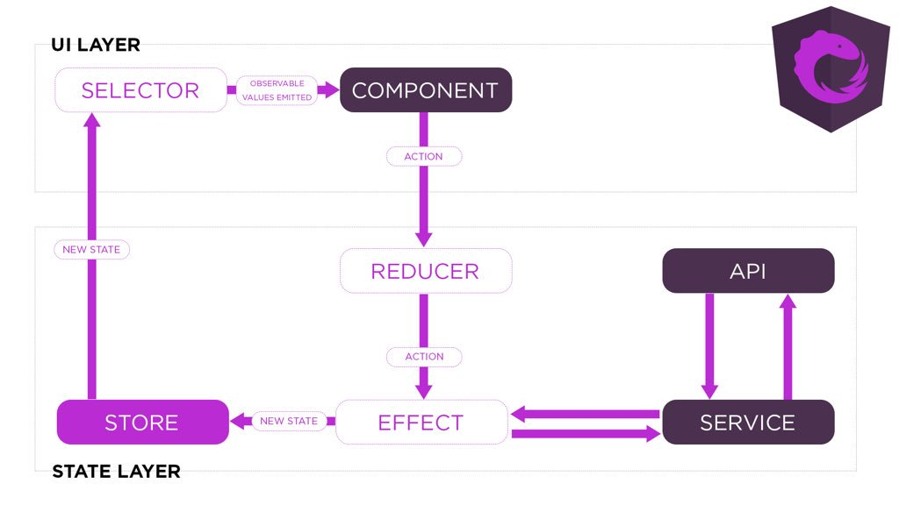

# FirstApp

This app shows how NgRx works with simple example:

#####Have a look at the working application at  [this link](http://ngrxbucket.s3-website.us-east-2.amazonaws.com/).

---

### How the app works with NgRx:
When you click on the _"Increace Counter"_ or _"Send Message"_ button in **Component-1** - Angular dispatches action
, then reducer accepts and rewrites store to the entered value (increments the counter or writes the message you
 entered). **Component-2** subscribes to the counter and message changes in the store using selectors, and redraws the counter and message values each time they are updated in the store.
  
With _"Get post data"_ the same thing happens, only when you click on the button _"Get post data"_ - **Component-1
** sends action (GetData), where it is intercepted by effect. The effect takes data from the server and dispatch one
 more  action (GetDataSuccess) which  intercepted by the reducer. Further algorithm exactly as in _"Send Message"_.

##### Simplified NgRx algorithm diagram:

